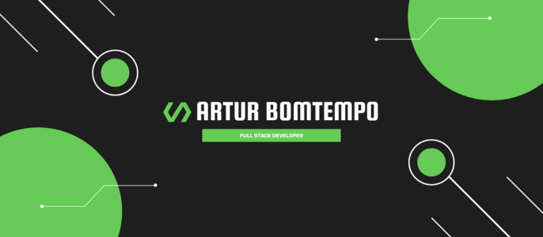

  <ul align="center" style="list-style: none">
    

      <h1>
         Welcome to my profile!
      </h1>
    

  </ul>

## 👤 &nbsp;About Me

Turning ideas into reality through software has always been my goal. My journey began at 15 with a technical IT course, and since then I’ve been exploring web and chatbot development, enjoying every step of the learning process. Teaching and sharing knowledge is a big part of what I do today.

### Quick Facts

- 🎓 Currently studying Software Engineering at PUC Minas
- 💻 Experienced with Node.js, Java, chatbot & web projects
- 📺 Content creator on YouTube and Instagram, passionate about helping others
- 🚀 Co-founded and served as CXO at a startup

### Connect with me

   

---

<picture>
  <source media="(prefers-color-scheme: dark)" srcset="https://raw.githubusercontent.com/arturbomtempo-dev/arturbomtempo-dev/output/pacman-contribution-graph-dark.svg">
  <source media="(prefers-color-scheme: light)" srcset="https://raw.githubusercontent.com/arturbomtempo-dev/arturbomtempo-dev/output/pacman-contribution-graph.svg">
  
</picture>

---

## ⭐️ &nbsp;GitHub Stats

---

## 🛠 &nbsp;Languages & Techs

### Tools

### Back-end

### Front-end

### Database

### Mobile

 

    

 
<b>Visitor Count</b>
  

 
 

